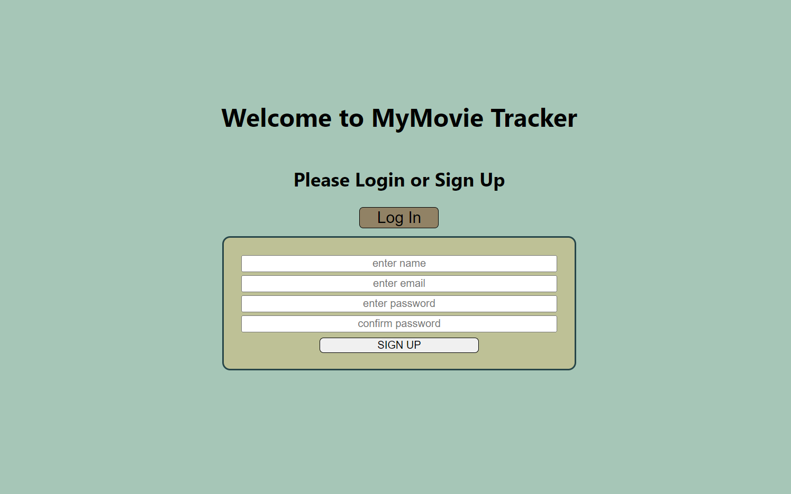
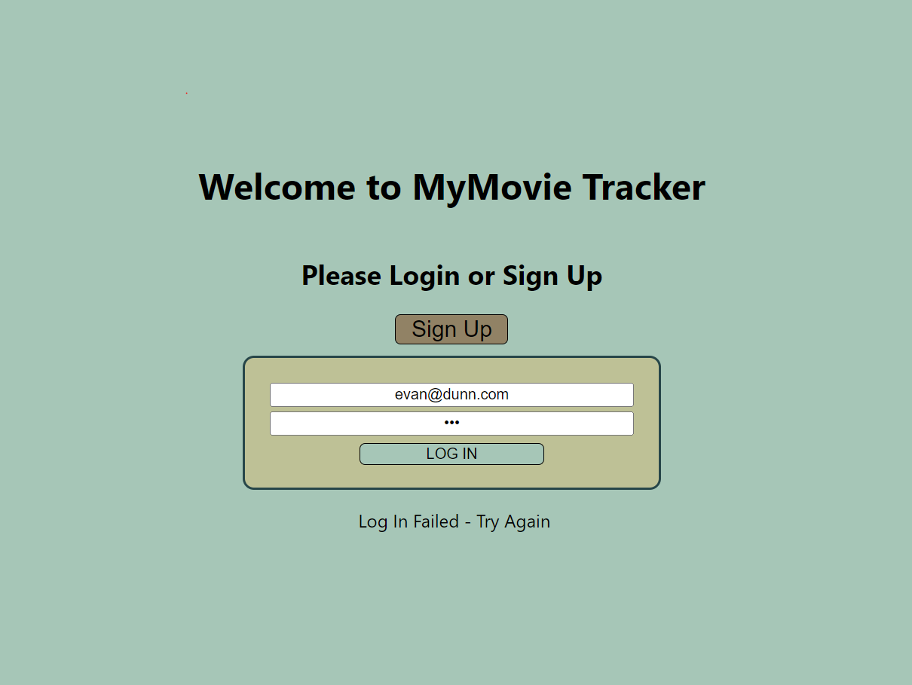
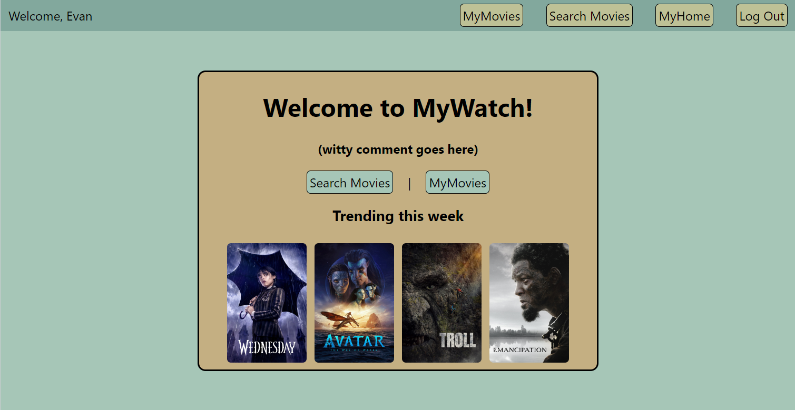
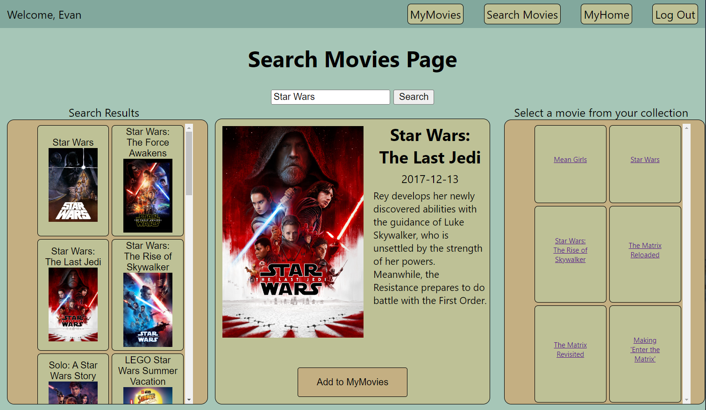
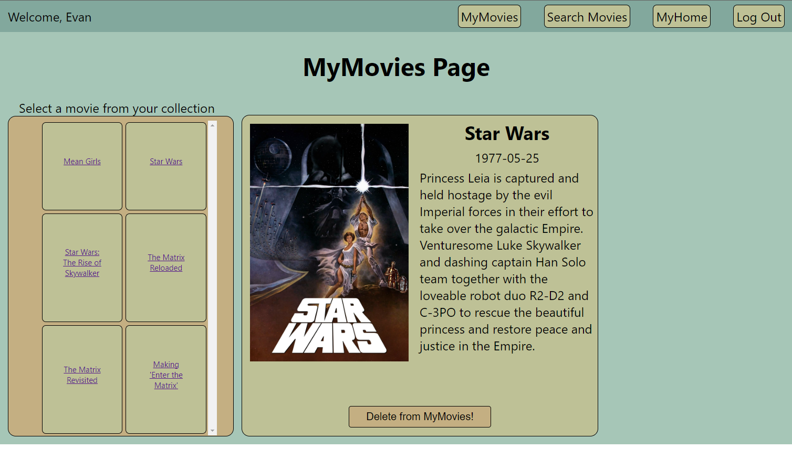

# Movie Tracker Read-Me

## Welcome to MyMovies.

This is a MERN Stack SPA where a user can keep track of movies they want to watch. First time users are able to sign up and existing users can login.  Users can search for movies and see a list of results.  Users can click on a search result for additional information and to add the selected movie to their 'MyMovies" list.  Users are able to view their "MyMovies" and remove from movies from thier list after watching. 

## Screen Shots

- Sign Up Page

- Login Page

- Landing Page

- Search Page

- MyMovies Page!

## Technologies Used
- Mongoose
- MongoDB
- Express
- React
- Node.js
- HTML5
- CSS 3
- JavaScript ES6
- Microsoft Paint 

- [The Movie Data Base(TMDB)](https://www.themoviedb.org/)
## Getting Started

[Link to Deployed App](https://imdb.com)

[Link to Trello board](https://trello.com/invite/b/YOBnTbBd/ATTI8ee0c9a0f0b1b3c5f487251a005989b515614C7C/gig-tracker)

## Next Steps/Ice Box
- Implement the following user stories:
    - AAU I want to search for TV shows
    - AAU I want to search for Actors
    - AAU I want to add tv shows to a "MyShows" list
    - AAU I want to add actors to a "MyActors" list
    - AAU I want to be able to click on trending movies/titles and see more info

- implement react-bootstrap
